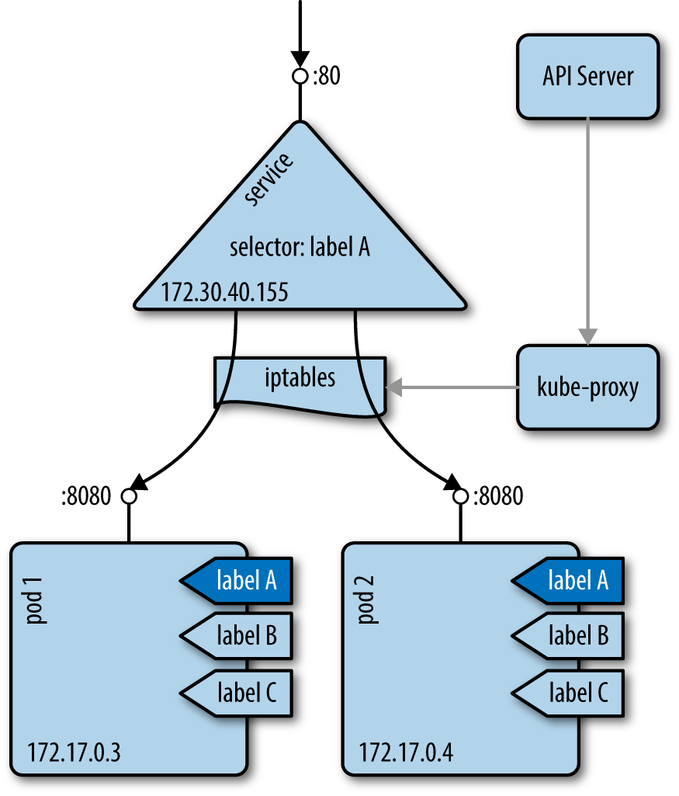

# 3 使用kubernetes客户端

## 3.1 查看资源

```bash
# kubectl get pods,services,deployments -n NAMESPACE
# kubectl get all
```

简称：

- configmaps - cm
- daemonsets - ds
- deployments - deploy
- endpoints - ep
- events - ev
- horizontalpodautocalers - hpa
- ingresses - ing
- namespaces - ns
- nodes - no
- persistentvolumecliams - pvc
- persistentvolumes - pv
- pods - po
- replicasets - rs
- replicationcontrollers - rc
- resourcequotas - quota
- serviceaccounts - sa
- services - svc

## 3.2 删除资源

不要直接删除被监控的对象，如有部署控制的Pod等。应该先关闭它们的监控进程，或使用特定的操作删除被管理的资源。例如，可以想将一个部署缩小到0个副本(参照9.1节)，然后就可以有效地删除它监控的所有Pod了。

另外需要考虑的一点是级联删除与直接删除。如，当删除一个自定义的资源定义(CRD, 13.4节)时，其所有的依赖对象也会被删除。更多关于级联删除规则的信息参照：https://kubernetes.io/docs/concepts/workloads/controllers/garbage-collection/

## 3.3 使用kubectl观察资源的变换

```bash
# kubectl get pods --watch
# watch kubectl get pods
```

## 3.4 使用kubectl编辑资源

```bash
# kubectl run nginx --image=nginx
# kubectl edit deploy/nginx
```

## 3.5 通过kubectl解释资源和字段

```bash
# kubectl explain svc
# kubectl explain svc.spec.externalIP
```

# 4 创建与修改基础工作负载

## 4.1 通过kubectl run 创建部署

kubectl run 命令是即可创建部署的清单文件的生成器。

```bash
# kubectl run ghost --image=ghost:0.9
# kubectl get deploy/ghost
```

kubectl run命令有许多选项用与设置部署参数：

- --env , 设置环境变量
- --port  定义容器端口
- --command 定义运行的命令
- --expose 自动创建一个关联的服务
- --replocas 定义pod的数量

```bash
$ kubectl run ghost --image=ghost:0.9 --port=2368 --expose # 在端口2368上启动Ghost，并随之创建一个服务
$ kubectl run mysql --image=mysql:5.5 --env=MYSQL_ROOT_PASSWORD=root 
$ kubectl run myshell --image=busybox --command -- sh -c "sleep 3600"
```

`kubectl run --help`查看各个参数的详细信息

## 4.2 通过清单文件创建对象

kubectl create 命令可以使用指向某个URL或本地文件系统中的yaml文件

```bash
# cat myns.yaml
apiVersion: v1
kind: namespace
metadata:
  name: myns
# kubectl create -f myns.yaml
# kubectl create -f https://raw.githubusercontent.com/kubernetes/kubernetes/ \
master/examples/guestbook/frontend-deployment.yaml
```

## 4.3 从零创建pod的清单文件

除非有特殊原因，否则不要单独创建Pod。应该使用一个部署对象(4.4节)监管Pod。它会通过另外一个叫做ReplicaSet(副本集)的对象监控Pod。

## 4.4 Lauching a Deployment Using a Manifest

Writing a manifest using the **Deployment** object 

```bash
# vim fancyapp.yaml
apiVersion: extensions/v1beta1
kind: Deployment
metadata:
   name: fancyapp
 spec:
   replicas: 5
   template:
     metadata:
       labels:
         app: fancy
         env: development
     spec:
       containers:
       - name: sise
         image: mhausenblas/simpleservice:0.5.0
         ports:
         - containerPort: 9876
         env:
         - name: SIMPLE_SERVICE_VERSION
           value: "0.9"
```

things should be done when lauching the app:

- set the number of pods (replicas), or identical copies, that should be launched and supervised.
- Label it , such as with env=development
- set environment variabls such as SIMPLE_SERVICE_VERSION

**如果想要删除一个部署及其replica set 和其监管的pods, 执行kubectl delete deploy/fancyapp.单独删除Pod，Deployment会重建Pod**

Deployments allow you to scale the app(Recipe 9.1) as well as roll out a new version or roll back to a previous version. In General, **Deployments are good for stateless apps that require with identical characteristics**

deployment负责监管Pod和replicaset，可以允许你细致地控制如何以及何时应该将Pod设计到新版本或回滚到之前的版本。一般来说无需在意Deployment监管的Pod与replicaset，除非特写特殊情况，比如需要调试某个Pod。

使用replicaset代替原来的replication controller.虽然目前两者唯一的区别在于replicaset支持与集合为基础的标签与查询，但以后会有更多功能加入到replicaset，而RC将逐步退出舞台。

## 4.5 更新部署

```bash
$ kubectl run sise --image=mhausenblas/simpleservice:0.4.0
$ kubectl set image deployment sise mhausenblas/simpleservice:0.5.0
$ kubectl rollout status deployment sise
$ kubectl rollout history deployment sise
$ kubectl edit deploy sise
```

如何设置并export了环境变量KUBE_EDITOR的话，将会在指定的编辑器中打开当前部署。

```bash
$ kubectl rollout history deployment sise
deployments "sise"
REVISION        CHANGE-CAUSE
1               <none>
2               <none>
3               <none>
```

kubectl rollout history deployment sise可查看历史版本。**CHANGE-CAUSE一栏为空是因为没有使用kubeclt create 的--record选项** , 如果想连接什么变更触发了新的版本，可以加上此选项。

还有很多的kubectl命令可以用于更新部署：

- kubectl apply, 根据清单文件更新部署。
- kubectl replace, 根据清单文件替换部署，与apply不同的是replace对象必须存在。
- kubectl patch，更新特定的键值

```bash
kubectl patch deployment sise -p '{"spec": {"template":
{"spec": {"containers":
[{"name": "sise", "image": "mhausenblas/simpleservice:0.5.0"}]}}}}'
```

**回滚**

```bash
$ kubectl rollout undo deployment sise --to-version=2
```

回退到版本2

可以通过`kubectl get deploy/sise -o yaml`确认端口定义已经被删除

> NOTE: 只有Pod模板(即.spec.template下的键值)的变更才可以触发新的部署。例如：环境变量，端口或容器镜像。部署方面的变更，比如副本个数等不会触发新的部署。

# 5 使用服务

Kubernetes service的具体内容如下图所示



service为一组Pod提供稳定的虚拟IP地址(Virtual IP, VIP). 即使加入新的pod 或移除已有Pod，service也能保证客户端可以通过VIP可靠地发现并连接到pod中运行的容器。VIP中的virtual的意思是说该IP并不是连接到网络接口的真实IP地址，它的目的只是为了将访问发送到一个或多个Pod。kube-proxy负责维护VIP与Pod之间的映射，集群中的每个节点都需要运行该进程。 kube-proxy进程查询API服务器以获知集群中的新服务，并相应第更新节点的iptables规则，以提供必要的路由信息。

## 5.1 Creating a Service to Expose Your Application

如何在集群内提供一个稳定可靠的方法，发现并访问应用？

通过为应用的Pod创建service来实现

```bash
$ kubectl run nginx --image=nginx
$ kubectl expose deploy/nginx --port 80
```

kubectl expose命令会创建一个service

如果想用浏览器访问该服务，那么可以在另一个中断运行代理，如下所示：

```bash
$ kubectl proxy --address='0.0.0.0'  --accept-hosts='^*$'
```

浏览器访问：http://localhost:8001/api/v1/namespaces/default/services/nginx/proxy/

同样也可以通过yaml文件创建service

```bash
$ cat svc-nginx.yaml
apiVersion: v1
kind: Service
metadata:
  name: nginx
spec:
  selector:
    run: nginx
  ports:
  - port: 80
```

需要注意的是yaml文件中的selector ，which is used to select all the pods that make up this microservice abstraction. **Kuberbetes uses the Service object to dynamically configure the iptables on all nodes to be abole to send the network traffic to the contaners that make up the microservice**. selector是一个标签查询，返回一组访问点。

如果服务运行出现问题，检查selector使用的标签，并确认kubectl get endpoints可以返回一组访问点。如果不能，则可能是selector没有找到匹配的pod.

pod的监控程序(如deployment, replicaset等)可以直接操作service。监控程序与service可以使用标签找到所需的Pod，但它们的职能不同：**监控程序负责管理Pod的健康并负责重启Pod，而 service则负责提供可靠的访问渠道**。

## 5.2 Verifing the DNS Entry of a Service验证service的DNS注册项

在创建service后，如何验证service是否成功注册了DNS？

Solution：

By default kubernetes uses **ClusterIP** as th service type, and that exposes the service on a cluster-internal IP.默认情况下，kubernetes service type是ClusterIP，并通过集群的内存IP公布服务。如果集群的DNS插件工作正常，则可以通过全称域名(Fully Qualified Domain Name, FQDN), 以$SERVICENAME.$NAMESPACE.svc.cluster.local的形式访问该服务。

在集群的容器内通过交互式shell，来验证服务是否正常工作。

```bash
$ kubectl run busybox --image busybox -it -- /bin/sh
/ # nslookup nginx
```

以上命令返回的service IP地址是它的集群IP地址。

## 5.3 改变service type

如果已有一个service，其service type为ClusterIP类型，如果改变其类型，使之以NodePort类型发布应用程序？或通过云提供商的负载均衡器，使用LoadBalancer service type.

使用kubectl edit改变其服务类型，比如现有service，清单文件simple-nginx-svc.yaml如下:

```yaml
kind: Service
apiVersion: v1
metadata:
  name: webserver
spec:
  ports:
  - port: 80
  selector:
    app: nginx
```

创建webserver并查询

```bash
$ kubectl create -f simple-nginx-svc.yaml
$ kubectl get svc/webserver
```

更改服务类型为NodePort

```bash
$ kubectl edit svc/webserver
```

保存编辑后通过下面的命令确认变更后的服务：

```bash
$ kubectl get svc/webserver
$ kubectl get svc/webserver -o yaml
```

注意，服务类型可根据实际情况随意修改。但某型类型可能有隐藏的规则，比如LoadBalancer，可能会触发公有云基础设施组件的配置，如果在不知情或没有监控的情况下使用，可能会造成昂贵的开销。

## 5.4 在minikube上配置ingress controlller

ingress 可以帮助我们从kubernetes集群的外部访问kubernetes上运行的应用程序，而无需创建NodePort或LoadBalancer类型的服务，如何配置？

部署Ingress控制器，才能让Ingress对象生效并提供从集群外部访问Pod的路由。在minikube上激活ingress插件的命令如下:

```bash
$ minikube addons enable ingress
$ minikube addons list | grep ingress
- ingress: enabled
```

大约1分钟后，kube-system命名空间将出现两个新的pod:

```bash
$ kubectl get pods -n kube-system
NAME                                        READY   STATUS    RESTARTS   AGE
...
default-http-backend-66664b9769-gxhjj       1/1     Running   0          141m
...
nginx-ingress-controller-7b465d9cf8-4pmtm   1/1     Running   0          141m
...
```

现在可以创建Ingress对象了。

参阅文档：
- [Ingress的文档][https://kubernetes.io/docs/concepts/services-networking/ingress/]
- [基于nginx的ingress控制器源代码][https://github.com/kubernetes/ingress-nginx/blob/master/README.md]

**Kubernetes的三种外部访问方式：NodePort LoadBalaner Ingress**

NodePort LoadBalancer Ingress都是**将集群外部流量引入到集群内部**的方式 , 只是实现方式不同。

1.  **ClusterIP**

   ​	ClusterIP 类型是Kubernetes默认service tyep. 它是一个**集群内**的服务，集群内的其它应用都可以访问该service。集群外部无法访问它。

   如果从Internet没法访问ClusterIP类型的service，那么我们为什么还要讨论它呢？那是因为我们可以通过Kubernetes的proxy模式来访问该服务，示意图如下：

   

ClusterIP类型的service的yaml文件类似如下：

```yaml
apiVersion: v1
kind: Service
metadata:  
  name: my-internal-service
spec:
  selector:    
    app: my-app
  type: ClusterIP
  ports:  
  - name: http
    port: 80
    targetPort: 80
    protocol: TCP
```

启动kubernetes proxy模式：

```bash
$ kubectl proxy --port=8080
```

这样就可以通过kubernetes API， 使用如下模式来访问这个service：

```
http://localhost:8080/api/v1/proxy/namespaces/<NAMESPACE>/services/<SERVICE-NAME>:<PORT-NAME>/
```

要访问上面定义的service, 使用如下地址：

```
http://localhost:8080/api/v1/proxy/namespaces/default/services/my-internal-service:http/
```

何时使用这种方式(ClusterIP)?

下面几个场景可以使用kubernetes proxy访问你 的service:

- 由于某些原因，你需要调试你的service , 或者需要直接通过笔记本电脑去访问它们。
- 允许内部通信，展示内部仪表盘等

这种方式要求我们运行kubectl作为一个未认证的用户，因此我们不能用这种方式把service暴露到internet或在生产环境使用。

2. **NodePort**

   ​	NodePort类型服务是引导外部流量到你的service的最原始的方法。正如其名，在所有的node上打开特定的端口，任何发往这个端口的流量都会被转发到service上。示意图如下：

   

NodePort type service的yaml文件大致如下：

```yaml
apiVersion: v1
kind: Service
metadata:  
  name: my-nodeport-service
spec:
  selector:    
    app: my-app
  type: NodePort
  ports:  
  - name: http
    port: 80
    targetPort: 80
    nodePort: 30036
    protocol: TCP
```

NodePort类型service主要有两点区别于ClusterIP类型的服务。第一，它的类型是"NodePort"。有一个额外的端口，成为nodePort，它指定节点上开放的端口值。如果你不指定这个端口，系统选择一个随机端口。大多数时候我们应该让kubernetes来选择端口，用户自己来选择可用端口代价太大。

合适使用这种方式？

这种方式有许多缺点：

- 每个端口只能是一种服务
- 端口范围只能是30000-32767
- 如果节点/VM的IP都中发生变化，你需要能处理这种情况

基于以上原因，不建议在生产环境上用这种方式暴露service。如果你运行的服务不要求一直可用，或者对成本比较敏感，可以使用这种方法。这样的应用的最佳例子是demo应用，或某些临时应用。

3. **LoadBalancer**

   ​	LoadBalancer 服务是暴露服务到Internet的标准方式。在GKE上，这种方式会启动一个Network Load Balancer，它将给你一个独立的IP地址，转发所有流浪到你的服务。示意图如下：

   

何时使用这种方式？

如果你向直接暴露服务，这就是默认方式。所有通往你指定端口的流量都会被转发到service上。没有过滤条件，没有路由等。这以为这你几乎可以发送任何形式的流量到该服务，如http, tcp, udp, Websocket, gRPC或其它任意种类。

**这个方式的最大缺点是每一个用LoadBalancer暴露的服务都会有它自己的IP地址，每个用到的LoadBalancer都需要付费，这僵尸非常昂贵的**.

4. **Ingress**

   ​	有别于以上所有的例子，Ingress事实上不是一种服务类型。相反，它处于多个服务的前端，扮演着"智能路由"或集群入口(entrypoint)的角色. 示意图如下：

   

   利用ingress可以做许多不同的事情，各种不同类型的Ingress控制器也有不同的能力。

   GKE上默认ingress控制器是启动一个HTTP(s) Load Balancer。它允许你基于路径或者字域名来路由流量到后端服务。例如，你可以将任何发往域名foo.yourdomain.com的流量转到foo服务，将路径yourdomain.com/bar/path的流量转到bar服务。

   GKE 上用 [L7 HTTP Load Balancer](https://cloud.google.com/compute/docs/load-balancing/http/) 生成的 Ingress 对象的 YAML 文件类似如下：

   ```yaml
   apiVersion: extensions/v1beta1
   kind: Ingress
   metadata:
     name: my-ingress
   spec:
     backend:
       serviceName: other
       servicePort: 8080
     rules:
     - host: foo.mydomain.com
       http:
         paths:
         - backend:
             serviceName: foo
             servicePort: 8080
     - host: mydomain.com
       http:
         paths:
         - path: /bar/*
           backend:
             serviceName: bar
             servicePort: 8080
   ```

   合适使用这种方式？

   Ingress可能是暴露服务的最强大的方式，但同事也是最复杂的。Ingress控制器有各种类型，包括Google Cloud Load Balancer, Nginx, Contour, Istio等等。它还有各种插件，如[cert-manager][https://github.com/jetstack/cert-manager], 它可以为你的服务自动提供SSL证书。

   如果你想要使用同一个 IP 暴露多个服务，这些服务都是使用相同的七层协议（典型如 HTTP），那么Ingress 就是最有用的。如果你使用本地的 GCP 集成，你只需要为一个负载均衡器付费，且由于 Ingress是“智能”的，你还可以获取各种开箱即用的特性（比如 SSL，认证，路由，等等）。

## 5.5 从集群外部访问服务

如何从集群外部访问Kubernetes的服务？
可以使用ingress控制器，可以通过创建ingress对象配置ingress控制器。Ingress规则(配置nginx服务路径)的清单文件如下所示：

```bash
$ cat nginx-ingress.yaml
kind:                                     Ingress
apiVersion:                               extensions/v1beta1
metadata:
  name:                                   nginx-public
  annotations:
    ingress.kubernetes.io/rewrite-target: /
spec:
  rules:
  - host:
    http:
      paths:
      - path:                             /web
        backend:
          serviceName:                    nginx
          servicePort:                    80

$ kubectl create -f nginx-ingress.yaml
```
然后就可以在dashboard中看到ingress对象了。
从kubernetes的仪表盘上，可以看到通过IP地址192.168.99.100访问nginx，并且清单文件定义了它的公开访问路径为/web。掌握了这些信息后就可以从外部访问nginx了：

```bash
$ curl -k https://192.168.99.100/web
```


